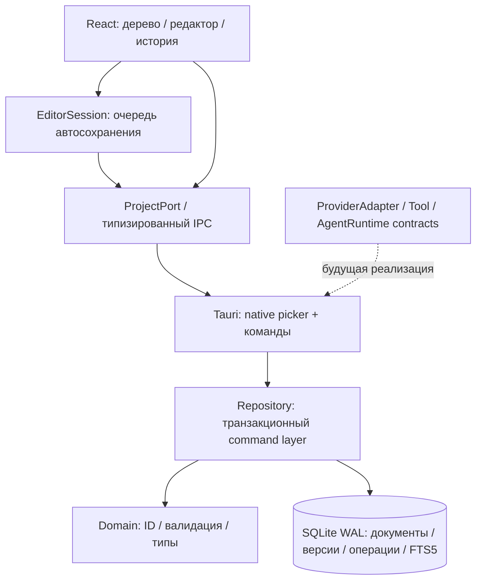

# Архитектура

## Срез 0.1

`Domain` не импортирует Tauri, SQLite, HTTP или UI. `Repository` зависит от Domain, но не от desktop shell. UI работает через порт и не имеет разрешений на произвольные файлы, shell или HTTP. DTO сериализуются Rust serde; TypeScript mirrors находятся в `packages/contracts`.

## Структура

| Каталог | Ответственность |
|---|---|
| `apps/desktop/src` | React, CodeMirror, редакторская сессия, типизированный IPC |
| `apps/desktop/src-tauri` | Windows shell, нативный выбор каталога, background commands |
| `crates/domain` | Доменные типы, лимиты, валидация, переходы жизненного цикла задач |
| `crates/project-repository` | SQLite, FTS, версии, журнал, optimistic concurrency |
| `packages/contracts` | IPC и контракты будущего runtime |
| `tests` | Browser smoke tests |
| `apps/desktop/tests` | Только тестовый порт; не включается Vite в production bundle |
| `docs/adr` | Зафиксированные решения |

## Поток сохранения

1. CodeMirror сообщает изменение текущей сессии. Сессия хранит черновик отдельно от последней подтверждённой версии.
2. Через 650 мс без ввода либо по Ctrl+S запускается сериализованная очередь. Один документ — не более одного IPC save одновременно.
3. Команда несёт UUID и expected revision. Backend начинает `BEGIN IMMEDIATE`.
4. Повторённый UUID проверяется по хешу параметров. Другая нагрузка с прежним UUID отвергается.
5. Проверяется ревизия, затем текст, версия, operation, receipt и FTS-триггеры фиксируются одной транзакцией.
6. Если во время сохранения появился новый ввод, очередь сохраняет следующий снимок с новой ревизией.
7. Переключение документа/проекта сначала ждёт flush. Ошибка блокирует переключение и не удаляет черновик.

UI одновременно редактирует один документ. Репозиторий выдаёт до 200 метаданных за запрос; текст остальных документов не читается. Папки открываются лениво. Поиск возвращает метаданные, а не весь набор текстов.

## Ограничения первого среза

- Длительная операция не отменяема внутри SQLite-транзакции; сейчас нет массовых agent jobs. До внедрения больших задач нужны отдельная очередь, cancellation token и durable task log.
- `Repository` пока конкретный SQLite command layer; Rust trait-порт для альтернативных хранилищ выделяется до второго адаптера. Domain не зависит от него, UI-port уже заменяемый.
- Windows state содержит один активный проект и mutex. Это последовательная модель, не multi-project runtime.
- Full snapshot каждого сохранения — надёжный прототип, но не окончательная масштабируемая версия истории.
- Формат UUID и revision готовит optimistic concurrency; не обещает CRDT/sync.
